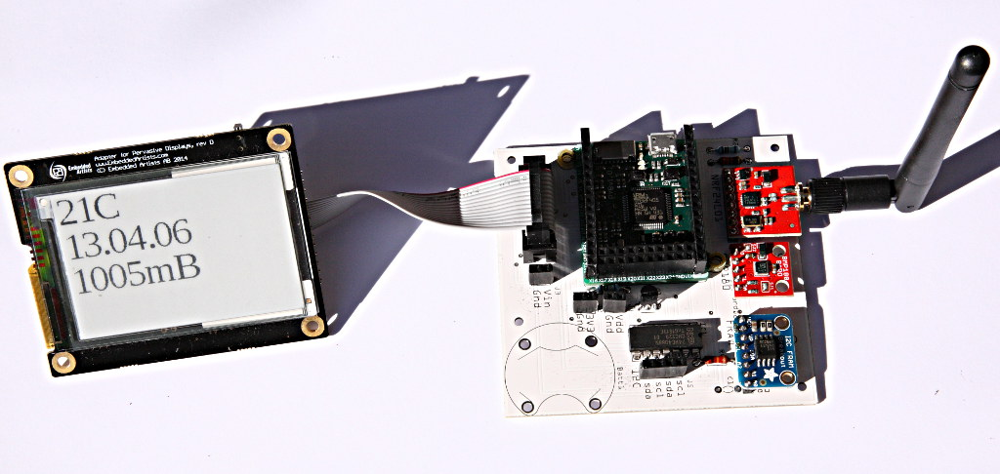

# micropython-micropower
Some ideas for building ultra low power systems based on the Pyboard

# Abstract

These notes describe some issues involved in minimising power draw in Pyboard based systems. A
circuit design and PCB layout are offered for achieving this when the Pyboard is used with external chips
or modules; it was specifically designed for the e-paper display and the NRF24L01 radio, but it could
readily be used with other devices. Some calculations are presented suggesting limits to the runtimes
that might be achieved from various types of batteries.

The power overheads of the Pyboard are discussed and measurements presented. These overheads comprise the
consumption of the voltage regulator and the charge required to recover from standby and to load and compile
typical application code.

A module ``upower.py`` is provided giving access to features useful in low power applications but not
supported in firmware at the time of writing.

Finally a suggestion is offered for an enhancement to a future Pyboard version.

## Use cases

I have considered two types of use case. The first is a monitoring application which periodically wakes,
reads some data from a sensor then returns to standby. At intervals it uses an NRF24L01 radio to send the
accumulated data to a remote host. The second is a remote display using the NRF24L01 to acquire data from
a remote host and an e-paper display to enable this to be presented when the Pyboard is in standby. In
either case the Pyboard might be battery powered or powered from a power constrained source such as solar
photovoltaic cells.

## Standby mode

To achieve minimum power the code must be designed so that the Pyboard spends the majority of its time in
standby mode. In this mode the current drawn by the MPU drops to some 4uA. The Pyboard draws about
30uA largely owing to the onboard LDO voltage regulator which cannot (without surgery) be disabled. Note that
on recovery from standby the code will be loaded and run from the start: program state is not retained.
Limited state information can be retained in the RTC backup registers: in the example below one is used to detect
whether the program has run because of an initial power up or in response to an RTC interrupt. A
typical application will use code along these lines:

```python
import pyb, stm
rtc = pyb.RTC()

usb_connected = pyb.Pin.board.USB_VBUS.value() == 1
if not usb_connected:
   pyb.usb_mode(None) # Save power

if stm.mem32[stm.RTC + stm.RTC_BKP1R] == 0:     # first boot
   rtc.datetime((2015, 8, 6, 4, 13, 0, 0, 0))   # Code to run on 1st boot only

 # code to run every time goes here
rtc.wakeup(20000)
stm.mem32[stm.RTC + stm.RTC_BKP1R] = 1 # indicate that we are going into standby mode
if not usb_connected:
   pyb.standby()
```

The ``usb_connected`` logic simplifies debugging using a USB cable while minimising power when run without USB. The
first boot detection is a potentially useful convenience.

There are three ways to recover from standby: an rtc wakeup, a tamper input, and a wakeup input. See below
for support for these in ``upower.py``.

## Nonvolatile memory and storage in standby

To obtain the 30uA current it is necessary to use the internal flash memory for program storage rather than
an SD card as SD cards draw significant standby current. The value varies with manufacturer but tends to dwarf
the current draw of the Pyboard - 200uA is common. 

Some applications will require data to be retained while the Pyboard is in standby. Very small amounts may
be stored in the RTC backup registers. The Pyboard also has 4KB of backup RAM which is more flexible and also
retains data in standby. Code for using these options is provided below.

In systems requiring true nonvolatile storage where data is retained after power loss as well as during standby
one option is to use files in the internal flash, but this raises the issue of endurance. The Flash is rated at
10,000 writes, a figure which is approached in a year even if the Pyboard only wakes and writes to it hourly.

A solution for small amounts of data is to use FRAM (ferroelectric RAM) which has extremely high
endurance and low power consumption. With the hardware described below the standby current is effectively
zero. A driver for FRAM may be found [here](https://github.com/peterhinch/micropython-fram.git) which
also details a source for the modules.

Larger volumes of data could be stored in an SD card whose power can be controlled as required: the Pyboard
has an sdcard driver enabling a card in an SPI adapter to be mounted in the filesystem. While lacking the
extreme endurance of FRAM it should offer an effective solution in most applications, with power switching
overcoming the "always on" limitation of the inbuilt SD card connector.

# Hardware issues

Most practical applications will have hardware peripherals connected to Pyboard GPIO pins and the
various Pyboard interfaces. To conserve power these should be powered down when the Pyboard is in standby,
and the Pyboard provides no means of doing this. In principle this could be achieved thus:


On first boot or on leaving standby the code drives the pin low, then drives it high before entering standby.
In this state the GPIO pins go high impedance, so the MOSFET remains off by virtue of the resistor.

Unfortunately this is inadequate for devices using the I2C bus or using its pins as GPIO. This is because
the Pyboard has pullup resistors on these pins which will source current into the connected hardware
even when the latter is powered down. There are two obvious solutions. The first is to switch Vdd as in the
above schematic (single-ended mode) and also to provide switches in series with the relevant GPIO pins. The second is to
switch both Vdd and Vss of the connected hardware (double-ended mode). I use the single ended approach.
The current consumed by the connected hardware when the Pyboard is in standby is then negligible compared to
the total current draw of 29uA. This (from datasheet values) comprises 4uA for the microprocessor and 25uA
for the LDO regulator.

This can be reduced further by disabling or removing the LDO regulator: I have measured 7uA offering the
possibility of a year's operation from a CR2032 button cell. In practice achieving this is dependent on the
frequency and duration of power up events.

## Design details

The following design provides for single ended switching as described above and also - by virtue of a PCB
design - simplifies the connection of the Pyboard to an e-paper display and the NRF24L01. Connections
are provided for other I2C devices namely ferroelectric RAM (FRAM) [modules](https://learn.adafruit.com/adafruit-i2c-fram-breakout)
and (rather arbitrarily) the BMP180 pressure sensor although these pins may readily be employed for other I2C modules.

The design uses two Pyboard pins to control the peripheral power and the pullup resistors. Separate control is
preferable because it enables devices to be powered off prior to disabling the pullups, which is
recommended for some peripherals. An analog switch is employed to disable the pullup resistors.

Resistors R3, R4 and capacitor C1 are optional and provide the facility for a switched filtered or
slew rate limited 3.3V output. This was provided for the FRAM modules which specify a minimum and maximum
slew rate: for these fit R3 and R4. In this instance C1 may be omitted as the modules have a 10uF capacitor
onboard.


An editable version is provided in the file epd_vddonly.fzz - this requires the free (as in beer) software
from [Fritzing](http://fritzing.org/home/) where PCB's can be ordered. The Fritzing software can produce
extended Gerber files for those wishing to producure boards from other suppliers.
 
## Driver micropower.py

This is generalised to provide for the single-ended or double-ended hardware. If two pins are specified it
assumes that the active high pin controls the pullups and the active low pin controls power as per the above
schematic. If a single pin is specified it is taken to control both.

The driver supports a single class ``PowerController``

### Methods

``PowerController()`` The constructor has two arguments being strings represnting Pyboard pins. If either
is ``None`` a double ended controller is assumed. Arguments:
 1. ``pin_active_high`` Driven high in response to ``power_up()``. In single ended mode, powers I2C pullups.
 2. ``pin_active_low`` Driven low in response to ``power_up()``. In single ended mode powers peripherals.

``power_up()`` No arguments. Powers up the peripherals, waits for power to settle before returning.
``power_down()`` No arguments. Powers down the peripherals. Waits for power to decay before powering down
the I2C pullups and de-initialising the buses (the I2C driver seems to require this).

The driver provides optional support for use as a context manager thus:

```python
from micropower import PowerController as pc
p = pc(pin_active_high = 'Y12', pin_active_low = 'Y11')
with p:
    f = FRAM(side = 'R')    # Instantiate the hardware under power control
    pyb.mount(f, '/fram')   # Use it
    os.listdir('/fram')
    pyb.mount(None, '/fram')# Perform any tidying up
```

Note that when peripheral is powered up it is usually necessary to create a device instance as shown
above. Typical device drivers use the constructor to initialise the hardware, so you can't rely on
a device instance persisting in a usable form after a power down event.

The ``power_up()`` and ``power_down()`` methods support nested calls, with power only being removed
at the outermost level. Use with care: the SPI and I2C buses will need to be re-initialised if they
are to be used after a ``power_down()`` call.

### Footnote: I2C

The Pyboard I2C bus driver doesn't respond well to the following sequence of events.
 1. Power up the peripheral.
 2. Initialise the bus.
 3. Power down the peripheral.
 4. Repeat the above sequence.

It is necessary to de-initialise the bus prior to re-initialising it. In principle this could be done
in the device constructor. However existing drivers are unlikely to do this. Consequently the
``PowerController`` does this on power down. I don't know of a similar issue with SPI, but the driver
de-initialises this on a precautionary basis.

# Pyboard modification
 
For the very lowest power consumption the LDO regulator should be removed from the Pyboard. Doing this
will doubtless void your warranty and commits you to providing a 3.3V power supply even when connecting
to the Pyboard with USB. The regulator is the rectangular component with five leads located near the
X3 pins [here](http://micropython.org/static/resources/pybv10-pinout.jpg).

A more readily reversible alternative to removal is to lift pin 3 (the pin on the bottom row nearest
to X3 on the above diagram) and link it to gnd.

Note that even with the regulator operational the Pyboard can be powered by applying 3.3V to its 3V3 pin.
There is little point in doing so as the regulator continues to draw current by virtue of an internal
diode linking its Vout pin to Vin.

# Some numbers

The capacity of small batteries is measured in milliamp hours (mAH), a measure of electric charge. For
purposes of measurement on the Pyboard this is rather a large unit, and milliamp seconds (mAS) is used here.
1mAH = 3600mAS. Note that, because the Pyboard uses a linear voltage regulator, the amount of current
(and hence charge) used in any situation is substantially independent of battery voltage.
 
After executing ``pyb.standby()`` and with the regulator non-operational the Pyboard consumes about 7uA.
In a year's running this corrsponds to an charge utilisation of 61mAH, compared to the 225mAH nominal
capacity of a CR2032 cell. With the regulator running, the current of 30uA corresponds to 260mAH per annum.
 
@moose measured the startup charge required by the Pyboard [here](http://forum.micropython.org/viewtopic.php?f=6&t=607).
This corresponds to about 9mAS or 0.0025mAH. If we start every ten minutes, annual consumption from
startup events is  
0.0025 x 6 x 24 x 365 = 131mAH. Adding the 61mAH from standby gives 192mAH, close to the
capacity of the cell. This sets an upper bound on the frequency of power up events to achieve the notional
one year runtime, although this could be doubled with an alternative button cell (see below). Two use cases,
where the Pyboard performs a task on waking up, are studied below.

## Use case 1: reading a sensor and transmitting the data

This was tested by reading a BMP180 pressure sensor and transmitting the data to a base station using
an NRF24L01 radio, both with power switched. The current waveform (red trace, 40mA/div, 100mS/div) is
shown below. The yellow trace shows the switched Vdd supply. Note the 300mA spike in the current waveform
when Vdd switches on: this is caused by the charging of decoupling capacitors on the attached peripherals.


On my estimate the charge used each time the Pyboard wakes from standby is about 23mAS (comprising
some 16mAS to boot up and 7mAS to read and transmit the data). If this ran once per hour the annual
charge use would be 23 x 24 x 365/3600 mAH = 56mAH to which must be added the standby figure of 61mAH or
260mAH depending on whether the regulator is employed. One year's use with a CR2032 would seem feasible
with the regulator disabled.

The code is listed to indicate the approach used and to clarify my observations on charge usage.
It is incomplete as I have not documented the slave end of the link or the ``radio`` module.

```python
import struct, pyb, stm
from radio import TwoWayRadio, RadioSetup
from micropower import PowerController
from bmp180 import BMP180

RadioSetup['ce_pin'] = 'X4'
ledy = pyb.LED(3)

def send_data():
    bmp180 = BMP180('Y')
    pressure = int(bmp180.pressure /100)
    nrf = TwoWayRadio(master = True, **RadioSetup)
    led_state = stm.mem32[stm.RTC + stm.RTC_BKP3R]
    led_state = max(1, (led_state << 1) & 0x0f)
    stm.mem32[stm.RTC + stm.RTC_BKP3R] = led_state
    # stop listening and send packet
    nrf.stop_listening()
    try:
        nrf.send(struct.pack('ii', pressure, led_state))
    except OSError:  # never happens
        pass
    nrf.start_listening()
    # wait for response, with 250ms timeout
    start_time = pyb.millis()
    timeout = False
    while not nrf.any() and not timeout:
        if pyb.elapsed_millis(start_time) > 250:
            timeout = True
    if timeout:
        ledy.on()
        pyb.delay(200) # get to see it before power goes down
        ledy.off()
    else:
        nrf.recv() # discard received data

rtc = pyb.RTC()

usb_connected = pyb.Pin.board.USB_VBUS.value() == 1
if not usb_connected:
    pyb.usb_mode(None) # Save power

if stm.mem32[stm.RTC + stm.RTC_BKP1R] == 0:     # first boot
    rtc.datetime((2015, 8, 6, 4, 13, 0, 0, 0)) # Arbitrary

p = PowerController(pin_active_high = 'Y12', pin_active_low = 'Y11')
with p:
    send_data()
rtc.wakeup(4000)
stm.mem32[stm.RTC + stm.RTC_BKP1R] = 1 # indicate that we are going into standby mode
if usb_connected:
    p.power_up()                        # Power up for testing
else:
    pyb.standby()
```

Measurements were performed with the slave nearby so that timeouts never occurred. A comparison of the current
waveform presented above with that recorded by @moose shows virtually identicalbehaviour for the first 180mS as
the Pyboard boots up. There is then a period of some 230mS until power is applied to the peripherals where
the board continues to draw some 60mA: compilation of imported modules to byte code is likely to be responsible
for the bulk of this charge usage. The code which performs the actual application - namely power control and
the reading and transmission of data is responsible for about a third of the total charge use.

## Use case 2: Displaying data on an e-paper screen

A more computationally demanding test involved updating an epaper display with the following script
 
```python
import pyb, epaper, stm
from micropower import PowerController
rtc = pyb.RTC()

usb_connected = pyb.Pin.board.USB_VBUS.value() == 1
if not usb_connected:
    pyb.usb_mode(None) # Save power

if stm.mem32[stm.RTC + stm.RTC_BKP1R] == 0:     # first boot
    rtc.datetime((2015, 8, 6, 4, 13, 0, 0, 0)) # Arbitrary

t = rtc.datetime()[4:7]
timestring = '{:02d}.{:02d}.{:02d}'.format(t[0],t[1],t[2])
p = PowerController(pin_active_high = 'Y12', pin_active_low = 'Y11')
a = epaper.Display(side = 'Y', use_flash = True, pwr_controller = p)
s = str(a.temperature) + "C\n" + timestring
a.mountflash() # Power up
with a.font('/fc/LiberationSerif-Regular45x44'):
    a.puts(s)
a.umountflash() # Keep filesystem happy
a.show()

rtc.wakeup(20000)
stm.mem32[stm.RTC + stm.RTC_BKP1R] = 1 # indicate that we are going into standby mode
if usb_connected:
    p.power_up()                        # Power up for testing
else:
    pyb.standby()
```

Modules epaper and micropower located [here](https://github.com/peterhinch/micropython-epaper.git).

This used an average of 85mA for 6S to do an update. Based on a disabled regulator, if the script
performed one refresh per hour this would equate to  
85 x 6/3600 = 141uA average + 7uA quiescent = 148uA. This would exhaust a CR2032 in 9 weeks. An
alternative is the larger CR2450 button cell with 540mAH capacity which would provide 5 months
running.

A year's running would be achievable if the circuit were powered from three AA alkaline cells - owing
to the 4.5V nominal output the regulator would be required in this instance:

Power = 141uA + 29uA quiescent = 170uA x 24 x 365 = 1.5AH which is within the nominal capacity of
these cells.

# Coding tips

## CPU clock speed

When coding for minimum power consumption there are various options. One is to reduce the CPU
clock speed: its current draw in normal running mode is roughly proportional to clock speed. However
in computationally intensive tasks the total charge drawn from a battery may not be reduced since
processing time will double if the clock rate is halved. This is a consequence of the way CMOS
logic works: gates use a fixed amount of charge per transition. If your code spends time waiting
on ``pyb.delay()`` reducing clock rate will help, but see below for an alternative solution.

## Module upower

This module provides ways of accessing features not supported by the firmware at the time of writing.
Check for official support before using. The module requires a firmware build dated
7th October 2015 or later.

Note on objects in this module. Once ``rtc.wakeup()`` is issued, methods other than
``enable()`` should be avoided as some employ the RTC. Issue ``rtc.wakeup()`` shortly
before `pyb.standby``.

The module provides the following functions:
 1. ``lpdelay`` A low power alternative to ``pyb.delay()``
 2. ``why`` Returns a string providing the cause of a wakeup
 3. ``now`` Returns RTC time in seconds and millisecs since the start of year 2000
 4. ``savetime`` Store current RTC time in backup RAM. Optional arg ``addr`` default 1021
 5. ``ms_left`` Enables a timed sleep or standby to be resumed after a tamper or WKUP interrupt.
 Requires ``savetime`` to have been called before commencing the sleep/standby. Arguments
 ``delta`` the delay period in mS, ``addr`` the address where the time was saved (default 1021)

The module instantiates the following objects, which can be imported and accessed.
 1. ``rtc`` Instance of pyb.rtc()
 2. ``bkpram`` Object providing access to the backup RAM.
 3. ``rtcregs`` Object providing access to the backup registers.
 4. ``tamper`` Enables wakeup from the Tamper pin X18
 5. ``wkup`` Enables wakeup from a positive edge on pin X1

### Function ``lpdelay()``

This function accepts two arguments, a delay in mS and a flag which forces use of ``pyb.delay()``.
The latter facilitates debugging at the repl: the function normally uses ``pyb.stop()`` to reduce
power consumption to 500uA, but using this kills the USB connection.

```python
import pyb
from upower import lpdelay
usb_connected = pyb.Pin.board.USB_VBUS.value() == 1
lpdelay(1000, usb_connected)
```

### Function ``why()``

On wakeup calling this will return one of the following strings:
 1. 'BOOT' The Pyboard was powered up or had a soft or hard reset
 2. 'TAMPER' Woken by the ``tamper`` object (event on pin X18)
 3. 'WAKEUP' Timer wakeup
 4. 'X1' Woken by a high going edge on pin X1

### Function ``now()``

Returns RTC time since the start of year 2000. Two integers are returned, the seconds value and a
value of milliseconds (from 0 to 999). The function is mainly intended for use in
implementing sleep or standby delays which can be resumed after an interrupt from tamper or WKUP.
Millisecond precision is meaningless in standby periods where wakeups are slow, but might be relevant to sleep.

### Function ``savetime()``

Store current RTC time in backup RAM. Optional argument ``addr`` default 1021. This uses two words
to store the seconds and milliseconds values produced by ``now()``

### Function ``ms_left()``

This produces a value of delay for presenting to ``wakeup()`` and enables a timed sleep or standby to be
resumed after a tamper or WKUP interrupt. To use it, execute ``savetime`` before commencing the sleep/standby.
Arguments ``delta`` normally the original delay period in mS, ``addr`` the address where the time was saved
(default 1021).

The test program ``ttest.py`` illustrates its use. Note that, at the time of writing (18th Oct 2015)
the firmware has a bug which resets the RTC after a tamper event. This prevents the resumption of
delays after a tamper event. A PR is in the pipeline.

### RTC Backup registers (``rtcregs`` object)

The real time clock supports 20 32-bit backup registers whose contents are maintained when in any
of the low power modes. These may be accessed as an integer array as follows:

```python
import pyb
from upower import rtcregs
rtcregs[5] = 1234
```

Register zero is used by the firmware and should be avoided. Other registers are initialised to
zero after power up and also after a tamper event.

### Backup RAM (``bkpram`` object)

This class enables the on-chip 4KB of RAM to be accessed as an array of integers or as a
bytearray. The latter facilitates creating persistent arbitrary objects using JSON or pickle.
Like all RAM its initial contents after power up are arbitrary. Note that the ``why()`` function
uses the topmost word (``bkpram[1023]``).

```python
from upower import bkpram
bkpram[0] = 22 # use as integer array
ba = bkpram.get_bytearray()
ba[4] = 0 # or as a bytearray
```

### Wakeup pin X1 (``wkup`` object)

Enabling this converts pin X1 into an input with a pulldown resistor enabled even in standby mode. A low to
high transition will wake the Pyboard from standby. The following code fragment illustrates its use.
A complete example is in ``ttest.py``.

```python
from upower import wkup
  # code omitted
wkup.enable()
if not usb_connected:
    pyb.standby()
```

The wkup object has the following methods and properties.
``wkup.enable()`` enables the wkup interrupt. Call just before issuing ``pyb.standby()`` and after
the use of any other methods as it reconfigures the pin.
``wkup. wait_inactive()`` Accepts a single optional argument ``usb_connected`` defaulting False:
if True causes the function to be REPL friendly in its use of ``lpdelay()``. This function returns when
pin X1 has returned low. This might be used to debounce the trailing edge of the contact period:
call ``lpdelay(50)`` after the function returns and before entering standby to ensure that contact
bounce is over.
``wkup.disable()`` disables the interrupt. Not normally required as the interrupt is disabled
by the constructor.

``wkup.pinvalue`` Property returning the value of the signal on the pin: 0 is low, 1 high.

### Tamper pin X18 (``tamper`` object)

This is a flexible way to interrupt a standby condition, providing for edge or level detection the
latter with hardware switch debouncing. Level detection operates as follows. The pin is normally
high impedance. At intervals a pullup resistor is connected and the pin state sampled. After a given
number of such intervals, if the pin continues to be in the active state, the Pyboard is woken. The
active state, polling frequency and number of samples may be configured using ``tamper.setup()``.

Note that in edge triggered mode the pin behaves as a normal input with no pullup. If driving from a
switch, you must provide a pullup (to 3V3) or pulldown as appropriate.

``tamper.setup()`` accepts the following arguments:
 1. ``level`` Valid options 0 or 1. In level triggered mode, determines the active level. In edge triggered
 mode, 0 indicates rising edge trigger, 1 falling edge.
 2. ``freq `` Valid options 1, 2, 4, 8, 16, 32, 64, 128: polling frequency in Hz.
 3. ``samples`` Valid options 2, 4, 8: number of consecutive samples before wakeup occurs.
 4. ``edge`` Boolean. If True, the pin is edge triggered. ``freq`` and ``samples`` are ignored.

``tamper.enable()`` enables the tamper interrupt. Call just before issuing ``pyb.standby()`` and after
the use of any other methods as it reconfigures the pin.
``tamper. wait_inactive()`` Accepts a single optional argument ``usb_connected`` defaulting False:
if True causes the function to be REPL friendly in its use of ``lpdelay()``. This function returns when
pin X18 has returned to its inactive state. In level triggered mode this may be called before issuing
``tamper.enable()`` to avoid recurring interrupts. In edge triggered mode where the signal is from
a switch it might be used to debounce the trailing edge of the contact period.
``tamper.disable()`` disables the interrupt. Not normally required as the interrupt is disabled
by the constructor.

``tamper.pinvalue`` Property returning the value of the signal on the pin: 0 is 0V regardless of ``level``

See ``ttest.py`` for an example of its usage.

## Module ttest

Demonstrates the ways to wake up from standby and how to differentiate between them.

To run this, edit your ``main.py`` to include ``import ttest``. Power the Pyboard from a source
other than USB. It will flash the yellow LED after boot and the green and yellow ones every ten seconds
in response to a timer wakeup. If pin X1 is pulled to 3V3 red and green will flash. If pin X18 is pulled
low red will flash.

# Hardware

Hardware as used for tests of power switched peripherals.



# Pyboard enhancements

Micropower operation would be simpler if a future iteration of the Pyboard included the following,
controllable in user code:  
 1. A switched 3.3V peripheral power output.  
 2. A facility to disable the I2C pullups.  

A facility to disable the regulator via its enable pin would enable the very lowest figures. It could
be controlled in code or by hardware means such as a solder bridge.
