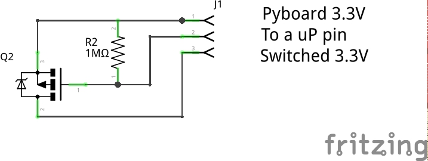
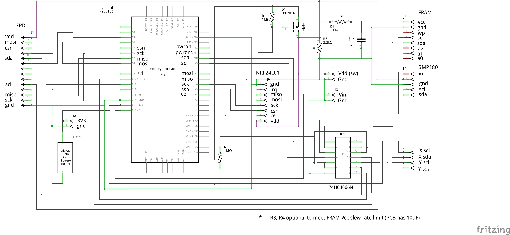

# micropython-micropower
Some ideas for building ultra low power systems based on the Pyboard

# Abstract

These notes describe some general points in achieving minimum power draw from Pyboard based systems. A
circuit design and PCB layout are offered for achieving this when the Pyboard is used with external chips
or modules; it was specifically designed for the e-paper display and the NRF24L01 radio, but it could
readily be used with other devices. Some calculations are presented suggesting limits to the runtimes
that might be achieved from various types of batteries.

Finally a suggestion is offered for an enhancement to a future Pyboard version.

## Use cases

I have considered two types of use case. The first is a monitoring application which periodically wakes,
reads some data from a sensor then returns to standby. At intervals it uses an NRF24L01 radio to send the
accumulated data to a remote host. The second is a remote display using the NRF24L01 to acquire data from
a remote host and an e-paper display to enable this to be presented when the Pyboard is in standby. In
either case the Pyboard might be battery powered or powered from a power constrained source such as solar
photovoltaic cells.

## Standby mode

To achieve minimum power the code must be deigned so that the Pyboard spends the majority of its time in
standby mode. In this mode the current drawn by the MPU drops to some 4uA. The Pyboard draws about
30uA largely owing to the onboard LDO voltage regulator which cannot (without surgery) be disabled. A
typical application will use code along these lines:

```python
import pyb, stm
rtc = pyb.RTC()

usb_connected = pyb.Pin.board.USB_VBUS.value() == 1
if not usb_connected:
   pyb.usb_mode(None) # Save power

if stm.mem32[stm.RTC + stm.RTC_BKP1R] == 0:     # first boot
   rtc.datetime((2015, 8, 6, 4, 13, 0, 0, 0))   # Code to run on 1st boot only

 # code to run every time goes here
rtc.wakeup(20000)
stm.mem32[stm.RTC + stm.RTC_BKP1R] = 1 # indicate that we are going into standby mode
if not usb_connected:
   pyb.standby()
```

The ``usb_connected`` logic simplifies debugging using a USB cable while minimising power when run without USB. The
first boot detection is a potentially useful convenience.

## Nonvolatile memory

To obtain the 30uA current it is necessary to use the internal flash memory rather than an SD card as the
latter draw significant standby current. The value varies with manufacturer but tends to dwarf the current
of the Pyboard - 200uA is common. This raises the issue of endurance if data is to be stored each time
power goes down. The Flash is rated at 10,000 writes, a figure which is approached in a year even if the
Pyboard only wakes hourly.

A solution for small amounts of data is to use FRAM (ferroelectric RAM) which has extremely high
endurance and low power consumption. With the hardware described below the standby current is effectively
zero. A driver for FRAM may be found [here](https://github.com/peterhinch/micropython-fram.git) which
also details a source for the modules.

# Hardware issues

Most practical applications will have hardware peripherals connected to Pyboard GPIO pins and the
various Pyboard interfaces. To conserve power these should be powered down when the Pyboard is in standby,
and the Pyboard provides no means of doing this. In principle this could be achieved thus:



On first boot or on leaving standby the code drives the pin low, then drives it high before entering standby.
In this state the GPIO pins go high impedance, so the MOSFET remains off by virtue of the resistor.

Unfortunately this is inadequate for devices using the I2C bus or using its pins as GPIO. This is because
the Pyboard has pullup resistors on these pins which will source current into the connected hardware
even when the latter is powered down. There are two obvious solutions. The first is to switch Vdd as in the
above schematic (single-ended mode) and also to provide switches in series with the relevant GPIO pins. The second is to
switch both Vdd and Vss of the connected hardware (double-ended mode). I use the single ended approach.
The current consumed by the connected hardware when the Pyboard is in standby is then negligible compared to
the total current draw of 29uA. This (from datasheet values) comprises 4uA for the microprocessor and 25uA
for the LDO regulator.

This can be reduced further by disabling or removing the LDO regulator: I have measured 7uA offering the
possibility of a year's operation from a CR2032 button cell. In practice achieving this is dependent on the
frequency and duration of power up events.

## Design details

The following design provides for single ended switching as described above and also - by virtue of a PCB
design - simplifies the connection of the Pyboard to an e-paper display and the NRF24L01. Connections
are provided for other I2C devices namely ferroelectric RAM (FRAM) [modules](https://learn.adafruit.com/adafruit-i2c-fram-breakout)
and (rather arbitrarily) the BMP180 pressure sensor although these pins may readily be employed for other I2C modules.

The design uses two Pyboard pins to control the peripheral power and the pullup resistors. Separate control is
preferable because it enables devices to be powered off prior to disabling the pullups, which is
recommended for some peripherals. An analog switch is employed to disable the pullup resistors.

Resistors R3, R4 and capacitor C1 are optional and provide the facility for a switched filtered or
slew rate limited 3.3V output. This was provided for the FRAM modules which specify a minimum and maximum
slew rate: for these fit R3 and R4. In this instance C1 may be omitted as the modules have a 10uF capacitor
onboard.



An editable version is provided in the file epd_vddonly.fzz - this requires the free (as in beer) software
from [Fritzing](http://fritzing.org/home/) where PCB's can be ordered. The Fritzing software can produce
extended Gerber files for those wishing to producure boards from other suppliers.
 
## Driver micropower.py

This is generalised to provide for the single-ended or double-ended hardware. If two pins are specified it
assumes that the active high pin controls the pullups and the active low pin controls power as per the above
schematic. If a single pin is specified it is taken to control both.

The driver supports a single class ``PowerController``

### Methods

``PowerController()`` The constructor has two arguments being strings represnting Pyboard pins. If either
is ``None`` a double ended controller is assumed
 1. ``pin_active_high`` Driven high in response to ``power_up()``. In single ended mode, powers I2C pullups.
 2. ``pin_active_low`` Driven low in response to ``power_up()``. In single ended mode powers peripherals.

``power_up()`` No arguments. Powers up the peripherals, waits for power to settle before returning.
``power_down()`` No arguments. Powers down the peripherals. Waits for power to decay before powering down
the I2C pullups and de-initialising the buses (the I2C driver seems to require this).

The driver provides optional support for use as a context manager thus:

```python
from micropower import PowerController as pc
p = pc(pin_active_high = 'Y12', pin_active_low = 'Y11')
with p:
    f = FRAM(side = 'R')    # Instantiate the hardware under power control
    pyb.mount(f, '/fram')   # Use it
    os.listdir('/fram')
    pyb.mount(None, '/fram')# Perform any tidying up
```

Note that when peripheral is powered up it is usually necessary to create a device instance as shown
above. Typical device drivers use the constructor to initialise the hardware, so you can;t rely on
a device instance persisting in a usable form after a power down event.

The ``power_up()`` and ``power_down()`` methods support nested calls, with power only being removed
at the outermost level. Use with care: the SPI and I2C buses will need to be re-initialised if they
are to be used after a ``power_down()`` call.

### Footnote: I2C

The Pyboard I2C bus driver doesn't respond well to the following sequence of events.
 1. Power up the peripheral.
 2. Initialise the bus.
 3. Power down the peripheral.
 4. Repeat the above sequence.

It is necessary to de-initialise the bus prior to re-initialising it. In principle this could be done
in the device constructor. However existing drivers are unlikely to do this. Consequently the
``PowerController`` does this on power down. I don't know of a similar issue with SPI, but it
de-initialises this on a precautionary basis.

# Pyboard modification
 
For the very lowest power consumption the LDO regulator should be removed from the Pyboard. Doing this
will doubtless void your warranty and commits you to providing a 3.3V power supply even when connecting
to the Pyboard with USB. The regulator is the rectangular component with five leads located near the
X3 pins [here](http://micropython.org/static/resources/pybv10-pinout.jpg).

A more readily reversible alternative to removal is to lift pin 3 (the pin on the bottom row nearest
to X3 on the above diagram) and link it to gnd.

Note that with the regulator operational the Pyboard can be powered by applying 3.3V to its 3V3 pin.
There is little point in doing so as the regulator continues to draw current by virtue of an internal
diode linking its Vout pin to Vin.

# Some numbers
 
With the regulator non-operational the Pyboard consumes about 7uA. In a year's running this corrsponds to
an energy utilisation of 61mAH, compared to the 225mAH nominal capacity of a CR2032 cell.
 
@moose measured the startup charge required by the Pyboard [here](http://forum.micropython.org/viewtopic.php?f=6&t=607).
This corresponds to about 9mAS or 0.0025mAH. If we start every ten minutes, annual consumption from
startup events is  
0.0025 x 6 x 24 x 365 = 131mAH. Adding the 61mAH from standby gives 192mAH, close to the
capacity of the cell. This sets an upper bound on the frequency of power up events to achieve the notional
one year runtime, although this could be doubled with an alternative button cell (see below).
 
A more computationally demanding test involved updating an epaper display with the following script
 
```python
import pyb, epaper, stm
from micropower import PowerController
rtc = pyb.RTC()

usb_connected = pyb.Pin.board.USB_VBUS.value() == 1
if not usb_connected:
    pyb.usb_mode(None) # Save power

if stm.mem32[stm.RTC + stm.RTC_BKP1R] == 0:     # first boot
    rtc.datetime((2015, 8, 6, 4, 13, 0, 0, 0)) # Arbitrary

t = rtc.datetime()[4:7]
timestring = '{:02d}.{:02d}.{:02d}'.format(t[0],t[1],t[2])
p = PowerController(pin_active_high = 'Y12', pin_active_low = 'Y11')
a = epaper.Display(side = 'Y', use_flash = True, pwr_controller = p)
s = str(a.temperature) + "C\n" + timestring
a.mountflash() # Power up
with a.font('/fc/LiberationSerif-Regular45x44'):
    a.puts(s)
a.umountflash() # Keep filesystem happy
a.show()

rtc.wakeup(20000)
stm.mem32[stm.RTC + stm.RTC_BKP1R] = 1 # indicate that we are going into standby mode
if usb_connected:
    p.power_up()                        # Power up for testing
else:
    pyb.standby()
```

Modules epaper and micropower located [here](https://github.com/peterhinch/micropython-epaper.git).

This used an average of 85mA for 6S to do an update. If the script performed one refresh per hour
this would equate to  
85 x 6/3600 = 141uA average + 7uA quiescent = 148uA. This would exhaust a CR2032 in 9 weeks. An
alternative is the larger CR2450 button cell with 540mAH capacity which would provide 5 months
running.

A year's running would be achievable if the circuit were powered from three AA alkaline cells - obviously
the regulator would be required in this instance:

Power = 141uA + 29uA quiescent = 170uA x 24 x 365 = 1.5AH which is within the nominal capacity of
these cells.

# A coding tip

When coding for minimum power consumption there are various options. One is to reduce the CPU
clock speed: its current draw in normal running mode is roughly proportional to clock speed. However
in computationally intensive tasks the total energy drawn from a battery may not be reduced since
processing time will double if the clock rate is halved. This is a consequence of the way CMOS
logic works: gates use a fixed amount of energy per transition.

If your code spends time waiting on ``pyb.delay()`` reducing clock rate will help. But also
consider this low power alternative to ``pyb.delay()``.

```python
def lpdelay(ms):
    rtc.wakeup(ms)
    pyb.stop()
    rtc.wakeup(None)
```

This reduces current consumption for the duration of the delay from 20mA to 500uA. Clearly it
assumes that the rtc can be dedicated to this task. This opens up an idea for a project: a
cooperative scheduler based on microthreading and using the rtc to schedule threads. This would
be for continuously running low power systems rather than ones using ``pyb.standby()`` and would
imply a current draw of 500uA while idle.

# Pyboard enhancements

Micropower operation would be simpler if a future iteration of the Pyboard included the following,
controllable in user code:  
 1. A switched 3.3V peripheral power output.  
 2. A facility to disable the I2C pullups.  

A facility to disable the regulator via its enable pin would enable the very lowest figures. It could
be controlled in code or by hardware means such as a solder bridge.
